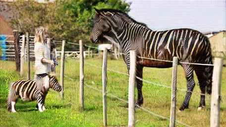

# Zebrate is zebra-horse transforming app

made with:
* [Streamlit](https://www.streamlit.io/)
* [Book](https://pytorch.org/assets/deep-learning/Deep-Learning-with-PyTorch.pdf)
* [PyTorch](https://pytorch.org/)
* [CycleGAN](https://github.com/keras-team/keras-io/blob/master/examples/generative/cyclegan.py)
* [ResNet](https://www.res.net/)
* [weights for model](https://github.com/deep-learning-with-pytorch/dlwpt-code/blob/master/data/p1ch2/horse2zebra_0.4.0.pth)
* [and this dataset](http://mng.bz/8pKP)

by [Dmitry Kosarevsky](https://github.com/dKosarevsky)
