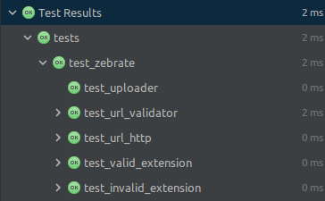
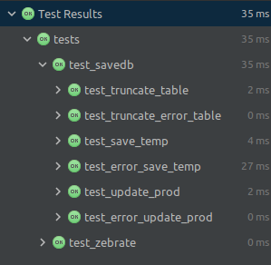

<p align="center">
  
</p>

### Министерство науки и высшего образования Российской Федерации
### Федеральное государственное бюджетное образовательное учреждение высшего образования
### «Московский государственный технический университет имени Н.Э. Баумана
### (национальный исследовательский университет)» (МГТУ им. Н.Э. Баумана)

ФАКУЛЬТЕТ Информатика и системы управления \
КАФЕДРА Программное обеспечение ЭВМ и информационные технологии \
ДИСЦИПЛИНА Тестирование программного обеспечения

### ОТЧЁТ ПО ЛАБОРАТОРНЫМ РАБОТАМ

Выполнил:
студент группы ИУ7-58Б(В) \
Косаревский Д.П. \
Преподаватель: Рогозин Н.О \
Москва, 2020 г.


#### Цель работы:
    • провести модульное тестирование проекта
    • провести интеграционное тестирование проекта
    • провести регрессионное тестирование проекта (управляющий граф)
    • провести функциональное тестирование проекта
    • настроить автоматизированное тестирование проекта

#### Описание проекта:
В качестве демонстрационного проекта было решено создать приложение **Zebrate**, 
преобразующее изображение лошади в изображение зебры на основе модели 
[CycleGAN](https://github.com/keras-team/keras-io/blob/master/examples/generative/cyclegan.py). \
Приложение работает на веб-сервисе Heroku по адресу [zebrate.herokuapp.com](https://zebrate.herokuapp.com/) \
На вход приложение может принимать текстовую ссылку на изображение,
также можно произвести загрузку изображения с локального устройства.
После чего происходит преобразование с помощью генеративно-состязательной нейронной сети ([GAN](https://en.wikipedia.org/wiki/Generative_adversarial_network))
На выходе приложение отображает преобразованное приложение.

### Использованные технологии:
Приложение **Zebrate** был реализовано с использованием языка [Python 3.8.5](https://www.python.org/downloads/release/python-385/), 
для реализации приложения в вебе была выбрана библиотека [Streamlit](https://www.streamlit.io/),
В качестве основного фреймворка для работы с нейронными сетями был выбран современный промышленный стандарт [PyTorch](https://pytorch.org/).
Тестирование было осуществлено с помощью библиотеки [Pytest](https://docs.pytest.org/en/latest/#) с
использованием вспомогательных библиотек coverage, pytest-cov, pytest-check для проведения удобных тестов, а также контроля покрытия приложения тестами.
Для автоматизированного тестирования был использован сервис ...

## Модульное тестирование.
**Модульное тестирование** - процесс, позволяющий проверить на
корректность отдельные модули исходного кода программы, наборы из одного
или более программных модулей вместе с соответствующими управляющими
данными, процедурами использования и обработки.
Модульное тестирование направлено на проверку правильности работы
модулей отдельно друг от друга. Модульное тестирование удобно проводить
с использованием классов эквивалентностей.
Для юнит-тестирования были выбраны методы, которые проверяют
подаваемые на вход пользователем данные.

### Тесты
Метод `validate_url` позволяет пользователю вводить в текстовое поле
для ввода ссылку на изображение и делает простейшую валидацию введённых данных,
а метод `uploader` позволяет загружать изображения с расширениями `.jpg`, `.jpeg` или `.png`.

##### Были выделены следующие классы эквивалентности:
    • корректный ответ валидатора
    • некорректный ответ валидатора
    • введённая текстовая строка со ссылкой содержит в строке `http`
    • введённая текстовая строка со ссылкой НЕ содержит в строке `http`
    • введённая текстовая строка со ссылкой содержит допустимые расширения изображения
    • введённая текстовая строка со ссылкой НЕ содержит допустимые расширения изображения
    • корректный ответ метода загрузки файла
    • некорректный ответ метода загрузки файла

##### Таблица 1. Модульные тесты для компонента zebrate.py
| Тест | Входные данные | Ожидаемый результат | Фактический результат |
| ---- | -------------- | ------------------- | --------------------- |
| test_url_validator | поочередно все ссылки из переменной GOOD_URLS  | True, url is real | True, url is real |
| test_url_validator | поочередно все ссылки из переменной BAD_URLS  | False, NOT url | False, NOT url |
| test_url_validator | пустая строка  | False, url is absent | False, url is absent |
| test_url_validator | поочередно все числа (floats) из переменной NUMS | False, AttributeError | False, AttributeError |
| test_url_http | поочередно все ссылки из переменной GOOD_URLS | Is http in the url | Is http in the url |
| test_url_http | поочередно все ссылки из переменной BAD_URLS | make sure http isn't in url | make sure http isn't in url |
| test_valid_extension | поочередно все ссылки из переменной EXTENSIONS_URLS с подставлением в цикле каждого разрешения из переменной VALID_EXTENSIONS | Is extension in the url | Is extension in the url |
| test_invalid_extension | поочередно все ссылки из переменной EXTENSIONS_URLS с подставлением в цикле каждого разрешения из переменной INVALID_EXTENSIONS | Is extension NOT in url | Is extension NOT in url |
| test_uploader | строка с бинарным кодом файла | True, it's a file | True, it's a file |
| test_uploader | число 0 | False, NOT file | False, NOT file |

Примечание: используемые в тестах переменные заполнены входными данными по не избыточному принципу в соответствии с классами эквивалентности. 

<p align="center">
  
</p>

Рисунок 1 — результаты юнит-тестирования модуля `zebrate.py` 

##### Информация о покрытии тестами:
```
----------- coverage: platform linux, python 3.8.5-final-0 -----------
Name         Stmts   Miss  Cover   Missing
------------------------------------------
resnet.py       39     31    21%   7-8, 11-24, 27-28, 35-72, 75
savedb.py       46     37    20%   10-18, 23-36, 41-60, 64-65, 70-86
zebrate.py      68     31    54%   46-57, 65-68, 76-106
------------------------------------------
TOTAL          153     99    35%


============================= 481 passed in 3.68s ==============================
```
Благодаря использованию фикстур (good_url, bad_url, extension_url, valid_extension, invalid_extension, numbers)
мы смогли добиться грандиозного масштабирования тестов и провести их в большом кол-ве (481 шт.) при малом кол-ве кода самих тестов.

## Интеграционное тестирование

**Интеграционное тестирование** — тестирование на уровне
взаимодействия модулей друг с другом. Интеграционное тестирование для
групп модулей выполняется через их интерфейсы обычно методом «черного
ящика», но также возможно использование методов «серого» и «белого ящика».

Приложение **Zebrate** представляет собой несколько компонентов, имеющих зависимости от других.
Компонент `savedb.py` отвечает за сохранение изображений в формате `bytea`.

В качестве хранилища создана база данных `zebrate_db` с помощью объектно-реляционной системы управления БД PostgreSQL.
В базу данных сохраняются как изображения как из входного канала, так и уже преобразованные изображения.
Изображения из входного канала и преобразованные сохраняются в отдельные таблицы, `horse_files` и `zebra_files` соответственно.
Также. в качестве промежуточного хранилища, используются временные таблицы `horse_files_temp` и `zebra_files_temp`.
Каждая из четырёх таблиц имеет одинаковую структуру и содержит по три столбца:
- `id` - идентификатор, автоматически присваевается средствами БД
- `orig_filename` - название файла изображения
- `file_data` - изображение в формате `bytea`

В рамках проекта интеграционное тестирование проводилось для
компонента `savedb.py`. Компонент `savedb.py` вызывается из основного компонента `zebrate.py` и 
реализует сохранение изображений.

### Тесты
Метод `truncate` очищает временную таблицу базы данных.
Метод `save_to_temp_db` принимает на вход бинарный файл с изображением в строковом представлении сохраняет во временную таблицу в формате `bytea`.
Метод `update_prod_db` обогащает основную рабочую таблицу базы данных изображением из временной таблицы.
Фикстура `db_connection` создаёт временную базу данных с заданными параметрами и возвращает объект `connection`, 
позволяющий проводить необходимые нам тесты. По завершению тестов временная БД удаляется автоматически.

##### Были выделены следующие классы эквивалентности:
    • успешное очищение временной таблицы
    • неудачное очищение временной таблицы
    • успешное сохранение изображения во временную таблицу
    • неудачное сохранение изображения во временную таблицу - некорректный формат подаваемых на вход данных
    • неудачное сохранение изображения во временную таблицу - таблица отсутствует
    • успешное обогащение изображением основной таблицы
    • неудачное обогащение изображением основной таблицы

##### Таблица 2. Интеграционное тестирование на примере тестирования компонента savedb.py
| Тест | Входные данные | Ожидаемый результат | Фактический результат |
| ---- | -------------- | ------------------- | --------------------- |
| test_truncate_table | Объект `connection` и список действующих таблиц | True, table successfully truncated | True, table successfully truncated |
| test_truncate_error_table | Объект `connection` и список с некорректными именами таблиц | False, table does not exist | False, table does not exist |
| test_save_temp | Объект `connection`, список действующих таблиц и список, содердащий изображения в бинарном коде | True, image saved to temp table | True, image saved to temp table |
| test_error_save_temp | Объект `connection`, список действующих таблиц и список, содердащий некорректные данные, вместо бинарников с изображениями | False, can't escape float to binary | False, can't escape float to binary |
| test_error_save_temp | Объект `connection`, список с некорректными именами таблиц и список, содердащий изображения в бинарном коде | False, table does not exist | False, table does not exist |
| test_update_prod | Объект `connection` и список действующих таблиц | True, image saved to prod table | True, image saved to prod table |
| test_error_update_prod | Объект `connection` и список с некорректными именами таблиц | False, relation does not exist | False, relation does not exist |

Примечание: используемые в тестах переменные заполнены входными данными по не избыточному принципу в соответствии с классами эквивалентности. 

<p align="center">
  
</p>

Рисунок 2 — результаты интеграционного тестирования

Информация о покрытии тестами:
```
----------- coverage: platform linux, python 3.8.5-final-0 -----------
Name         Stmts   Miss  Cover   Missing
------------------------------------------
resnet.py       39     31    21%   7-8, 11-24, 27-28, 35-72, 75
savedb.py       35      0   100%
zebrate.py      68     31    54%   46-57, 65-68, 76-106
------------------------------------------
TOTAL          142     62    56%


============================= 599 passed in 10.85s =============================
```

## Регрессионное тестирование

to be continued...
